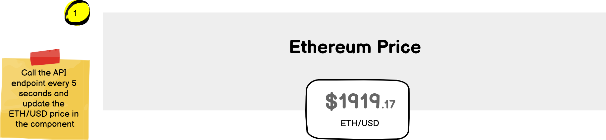
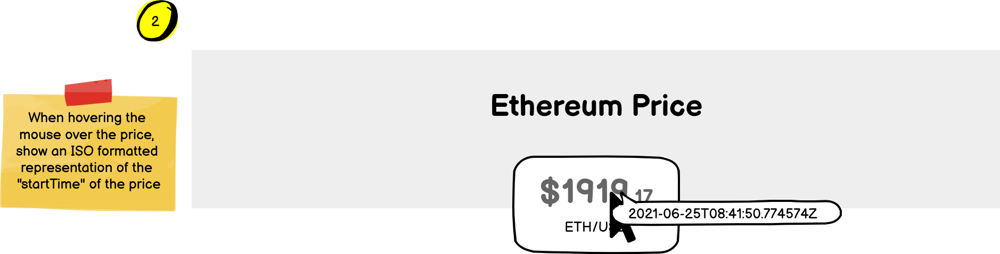
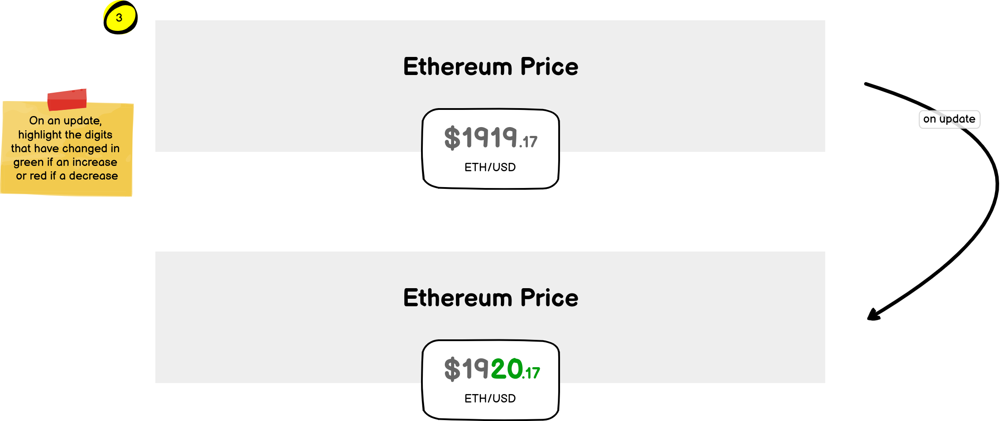
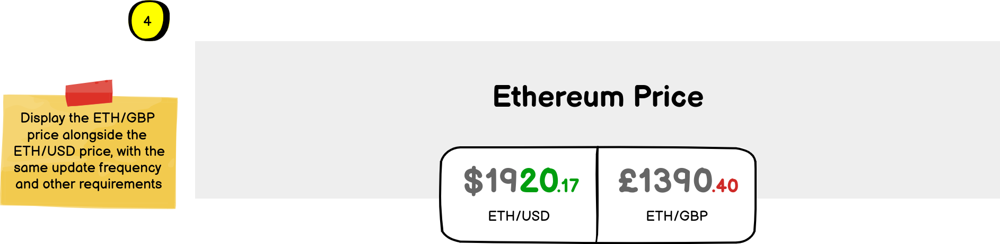

# eBit Labs front-end technical exercise

Thanks for applying for a front-end developer role at eBit Labs! This exercise is designed to allow you to demonstrate your development skills and for us to see how you think about solving a technical problem. It shouldn't take more than an hour to complete, and we'll use it as a starting point for our technical interview.

## Tech stack

- [Node.js](https://nodejs.org/en/)
- [TypeScript](https://www.typescriptlang.org/)
- [Vite](https://vitejs.dev/)
- [React](https://reactjs.org/)
- [Tailwind CSS](https://tailwindcss.com/)

## Getting started

- Fork this repo and clone locally
- `npm install`
- `npm run dev`

## The exercise

Please complete the steps below, committing your changes at the end of each step. Once you've finished, please push your repo to GitHub and share the URL with us (or zip up the Git repo and email it to us if you prefer).

### Step 1: Refresh the ETH/USD price every five seconds



Refresh the price displayed every five seconds, using the API endpoint details below.

```bash
$ curl http://34.117.120.204/api/v1/fx/ETHUSD/ohlc | json_pp

{
   "close" : "1937.06",
   "count" : 2,
   "endTime" : {
      "microseconds" : 0,
      "seconds" : 1624612260
   },
   "high" : "1937.06",
   "low" : "1936.2",
   "open" : "1936.2",
   "pair" : "ETH/USD",
   "startTime" : {
      "microseconds" : 554971,
      "seconds" : 1624612243
   },
   "volume" : "10.02570504",
   "vwap" : "1937.05779"
}
```

### Step 2: Add a timestamp tooltip



Add a tooltip to the price which displays an ISO-formatted representation of the `startTime`.

### Step 3: Highlight price changes



When the price changes, highlight the part of the price that has changed in red if the value has decreased or green if it has increased.

For example, if the price changes from `1919.17` to `1919.18` then the `8` should be green. If the price changes from `1919.17` to `1915.23` then `5.23` should be red.

### Step 4: Add the ETH/GBP price



Display the ETH/GBP price alongside the ETH/USD price, with the same update frequence and other requirements.
